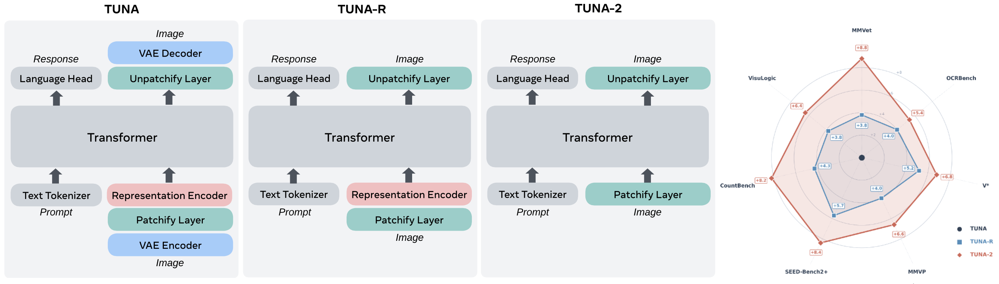

<div align="center">

# TUNA-2: Pixel Embeddings Beat Vision Encoders for Unified Understanding and Generation

[Zhiheng Liu](https://johanan528.github.io/)\*<sup>1,2</sup>,
[Weiming Ren](https://cs.uwaterloo.ca/~w2ren/)\*<sup>1,3</sup>,
[Xiaoke Huang](https://xk-huang.github.io/)<sup>1</sup>,
[Shoufa Chen](https://www.shoufachen.com/)<sup>1</sup>,
[Tianhong Li](https://www.tianhongli.me/)<sup>1</sup>,
[Mengzhao Chen](https://chenmnz.github.io/)<sup>2</sup>,
[Yatai Ji](https://yataiji.github.io/)<sup>2</sup>,
[Sen He](https://senhe.github.io/)<sup>1</sup>,
[Jonas Schult](https://jonasschult.github.io/)<sup>1</sup>,
[Belinda Zeng](https://www.linkedin.com/in/belindazeng/)<sup>1</sup>,
[Tao Xiang](https://www.surrey.ac.uk/people/tao-xiang)<sup>1</sup>,
[Wenhu Chen](https://wenhuchen.github.io/)<sup>3</sup>,
[Ping Luo](http://luoping.me/)<sup>2</sup>,
[Luke Zettlemoyer](https://www.cs.washington.edu/people/faculty/luke-zettlemoyer/)<sup>1</sup>,
[Yuren Cong](https://yrcong.github.io/)<sup>1</sup>

<sup>1</sup>Meta &nbsp; <sup>2</sup>The University of Hong Kong &nbsp; <sup>3</sup>University of Waterloo

\* Equal contribution

**[[Project Page]](https://tuna-ai.org/tuna-2)** &nbsp; **[[arXiv]](https://arxiv.org/abs/2604.24763)**

</div>

## Overview

We simplify [Tuna](https://arxiv.org/abs/2501.10441) by progressively stripping away its visual encoding components. By removing the VAE, we first derive **Tuna-R**, a pixel-space unified multimodal model (UMM) that relies solely on a representation encoder. **Tuna-2** further streamlines the design by bypassing the representation encoder entirely, utilizing direct patch embedding layers for raw image inputs. Tuna-2 using pixel embeddings outperforms both Tuna-R and Tuna across a diverse suite of multimodal benchmarks.

<p align="center">
  
</p>

## Generation Results

<p align="center">
  
</p>

## Installation

```bash
git clone https://github.com/facebookresearch/tuna-2.git
cd tuna-2
bash scripts/setup_uv.sh   # creates .venv with all dependencies
source .venv/bin/activate
```

<details>
<summary>Manual setup (if you prefer to drive uv yourself)</summary>

```bash
curl -LsSf https://astral.sh/uv/install.sh | sh
uv sync
uv pip install torch torchvision --index-url https://download.pytorch.org/whl/cu121
uv pip install -e .
source .venv/bin/activate
```

</details>

## Inference

All inference is done through a single unified script:

```bash
bash scripts/launch/predict.sh --ckpt <PATH> --prompt <TEXT> [OPTIONS]
```

### Options

| Flag | Values | Default | Description |
|---|---|---|---|
| `--ckpt` | path | *(required)* | Path to the model checkpoint |
| `--prompt` | text | *(required)* | Text prompt (t2i) or editing instruction (edit) |
| `--task` | `t2i`, `edit` | `t2i` | Inference task |
| `--variant` | `none_encoder`, `siglip_pixel`, `vae` | `none_encoder` | Model variant: **Tuna-2**, **Tuna-R**, or **Tuna** |
| `--size` | `7b`, `2b` | `7b` | Model size (2b only available for `--variant vae`) |
| `--resolution` | See table below | `512x512` | Output resolution (HxW) |
| `--gpu` | int | `0` | GPU device index |
| `--image` | path | — | Source image (required for `--task edit`) |
| `--steps` | int | `50` | Number of diffusion steps |
| `--guidance` | float | *(from config)* | Classifier-free guidance scale |
| `--seed` | int | `42` | Random seed |
| `--negative` | text | *(from config)* | Negative prompt |

### Supported Resolutions

| 512-class | 1024-class |
|---|---|
| `512x512` | `1024x1024` |
| `448x576` | `896x1152` |
| `576x448` | `1152x896` |
| `384x672` | `768x1344` |
| `672x384` | `1344x768` |

### Examples

See `assets/prompts.txt` for sample prompts.

```bash
# Tuna-2 (7B, no encoder, 512px)
bash scripts/launch/predict.sh \
    --ckpt /path/to/tuna_2_pixel_7b.pt \
    --prompt "A highly realistic beauty portrait in extreme close-up, showing the face of a young woman from just above the eyebrows down to the lips. Her skin is natural, luminous, and textured, with visible pores, fine facial hairs, subtle unevenness, and a slightly dewy finish, without heavy retouching or artificial smoothing."

# Tuna (2B, VAE latent, 512px)
bash scripts/launch/predict.sh \
    --variant vae --size 2b \
    --ckpt /path/to/tuna_2b.pt \
    --prompt "A brutally realistic cinematic close-up inside a real space station cupola, side profile of a blonde female astronaut floating in zero gravity beside the window, her loose braid drifting naturally, looking out at Earth in silence."
```

### Video

Due to policy constraints, we are unable to release the video generation model at this time. However, we provide the complete video training and inference codebase. If you are interested in training your own video model, this is a ready-to-use starting point — see `configs/train/video_t2v.yaml` for training configuration and `configs/predict/t2v_2b.yaml` for inference.

## TODO

- [ ] Release some of the Tuna-2 model weights.
- [ ] Release some of the Tuna model weights.
- [ ] Release the fully restored model weights (fine-tuned on external data to recover the missing layers).

### A Note on Model Release

Due to organizational policy constraints, we are unable to release the full production-trained model weights. To support the research community, we plan to release a **foundation checkpoint** with a small number of layers removed from both the LLM backbone and the diffusion head (flow head). The remaining layers and all other components (vision encoder, projections, embeddings, etc.) are fully preserved. With a short fine-tuning pass on your own data, the removed layers can be quickly re-learned and the model restored to full quality.

For detailed fine-tuning instructions, please refer to the [training guide](tuna/README.md).

Meanwhile, we are also actively working on fine-tuning the removed layers using external data, and plan to release the complete weights as soon as possible.

## Citation

```bibtex
@article{tuna2,
  title={TUNA-2: Pixel Embeddings Beat Vision Encoders
         for Unified Understanding and Generation},
  author={Liu, Zhiheng and Ren, Weiming and Huang, Xiaoke
          and Chen, Shoufa and Li, Tianhong and Chen, Mengzhao
          and Ji, Yatai and He, Sen and Schult, Jonas
          and Xiang, Tao and Chen, Wenhu and Luo, Ping
          and Zettlemoyer, Luke and Cong, Yuren},
  journal={arXiv preprint arXiv:2604.24763},
  year={2026}
}
```

```bibtex
@article{liu2025tuna,
  title={Tuna: Taming unified visual representations for native unified multimodal models},
  author={Liu, Zhiheng and Ren, Weiming and Liu, Haozhe and Zhou, Zijian and Chen, Shoufa and Qiu, Haonan and Huang, Xiaoke and An, Zhaochong and Yang, Fanny and Patel, Aditya and others},
  journal={CVPR2026},
  year={2026}
}
```

## License

This project is licensed under the Apache License 2.0. See [LICENSE](LICENSE) for details.
